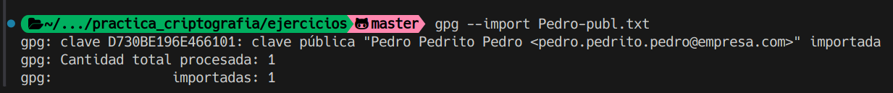
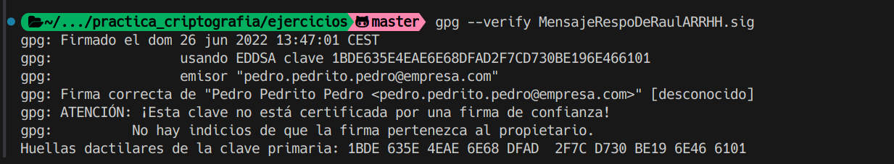
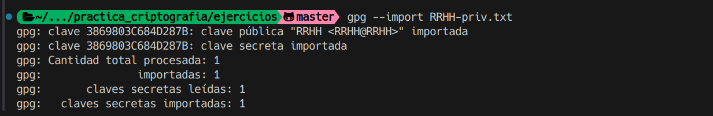

# Ejercicio 10

Se nos pide verificar la firma del fichero "MensajeRespoDeRaulARRHH.txt.sig" y evidenciar que el mensaje fue firmado por Pedro.

Además, se nos pide firmar el siguiente mensaje:

## Datos

```bash
Mensaje: Se debe ascender inmediatamente a Raúl. Es necesario 
mejorarle sus condiciones económicas un 20% para que se quede
con nosotros.

Firma pgp: MensajeRespoDRaulARRHH.txt.sig

Claves: Pedro-priv.txt y Pedro-publ.txt

Mensaje a firmar como RRHH: Viendo su perfil en el mercado, 
hemos decidido ascenderle y mejorarle un 25% su salario. Saludos.

Mensaje a cifrar con cable publica de RRHH y pedro: 
Estamos todos de acuerdo, el ascenso será el mes que viene, 
agosto, si no hay sorpresas.
```

## Procedimiento

Para verificar la firma del archivo "MensajeRespoDeRaulARRHH.txt.sig" debemos importar la clave pública de Pedro y verificar la firma del archivo:

```bash
gpg --import Pedro-publ.txt
```



Una vez importada la clave pública de Pedro, verificamos la firma del archivo "MensajeRespoDeRaulARRHH.txt.sig":

```bash
gpg --verify MensajeRespoDeRaulARRHH.txt.sig
```



Para firmar el segundo mensaje como si fueramos RRHH, primero importamos la clave privada de RRHH:

```bash
gpg --import RRHH-priv.txt
```



Necesitaremos el id de la clave privada que acabamos de importar, podemos verlas con `gpg --list-secret-keys`:


Con el id de la clave privada de RRHH, firmamos el mensaje usando `gpg --output <archivo_salida> --sign -u <id> mensaje.txt`:


Para cifrar el mensaje con la clave pública de RRHH y Pedro, importamos las claves publicas necesarias y comprobamos sus ids con `gpg --list-keys`:


Con los ids de las claves públicas de RRHH y Pedro, ciframos el mensaje con `gpg --output <archivo_salida> --encrypt --recipient <id> --recipient <id> mensaje.txt`:


El archivo cifrado está en `ejercicios/mensaje_cifrado.gpg`:
