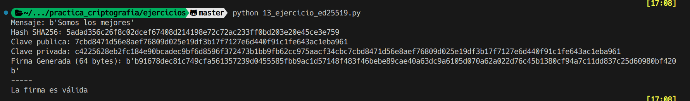

# Ejercicio 13

Se nos pide calcular una firma en hexadecimal con PKCS#1 v1.5 del mensaje dado. Para ello, se nos proporciona la clave privada y publica en formato pem.

Además, debemos calcular el valor de la firma hexadecimal con la curva elíptica ed25519 del mensaje dado con otras claves.

## Datos

mensaje: El equipo está preparado para seguir con el proceso, necesitaremos más recursos

clave privada: clave-rsa-oaep-priv.pem

clave publica: clave-rsa-oaep-publ.pem

clave privada ed: ed25519-priv

clave publica ed: ed25519-publ

## Procedimiento

Importamos nuestras claves publica y privada en formato pem y el mensaje a firmar. Calculamos el hash del mensaje con sha256 y firmamos el hash con la clave privada. Finalmente, mostramos la firma en hexadecimal.

El proceso para calcular la firma con la curva elíptica ed25519 es similar, importamos las claves y el mensaje, calculamos el hash del mensaje y firmamos el hash con la clave privada. Finalmente, mostramos la firma en hexadecimal.

