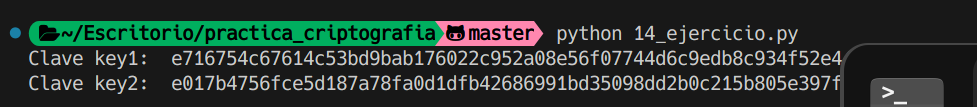

# Ejercicio 14

Se nos pide calcular una clave AES, usando una HKDF con SHA-512, se nos da una clave maestra en el keystore y un identificador de dispositivo.

## Datos

Master key: A2CFF885901A5449E9C448BA5B948A8C4EE377152B3F1ACFA0148FB3A426DB72
identificador: e43bb4067cbcfab3bec54437b84bef4623e345682d89de9948fbb0afedc461a3

## Procedimiento

Importamos la masterkey del keystore y el identificador del dispositivo. Calculamos la clave AES con HKDF y SHA-512. Finalmente, mostramos la clave en hexadecimal.

