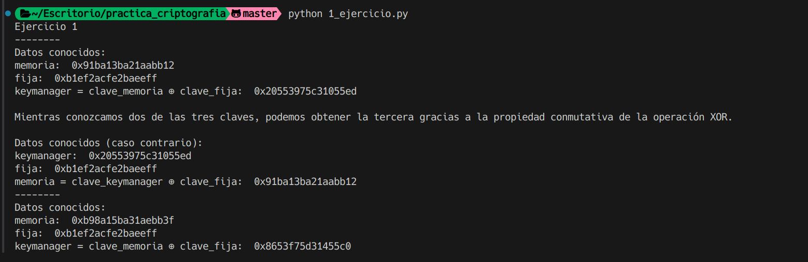

# Ejercicio 1

Se han disociado dos claves, se nos da una clave fija y otra clave que se ha obtenido de la memoria. Se nos pide que obtengamos la clave original establecida por el clavero.

## Datos

memoria:  0x91ba13ba21aabb12
fija:  0xb1ef2acfe2baeeff

## Procedimiento

Para obtener la clave original, se debe realizar una operación XOR entre la clave fija y la clave obtenida de la memoria. Gracias a la propiedad conmutativa de la operación XOR, se puede obtener la clave original:

```bash
0101 XOR 1100 = 1001

0101 XOR 1001 = 1100

1100 XOR 1001 = 0101
```

keymanager = clave_memoria XOR clave_fija:  0x20553975c31055ed

