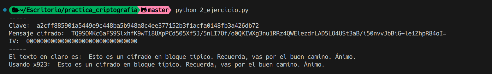

# Ejercicio 2

## Enunciado

Se nos pide descrifrar el mensaje cifrado con el algoritmo AES-256 en modo CBC y relleno PKCS.

## Datos

```bash
Tag en el keystore: cifrado-sim-aes-256

IV: 0000000000000000000000000000000 (16 bytes)

Clave: A2CFF885901A5449E9C448BA5B948A8C4EE377152B3F1ACFA0148FB3A426DB72

Cifrado: TQ9SOMKc6aFS9SlxhfK9wT18UXpPCd505Xf5J/5nLI7Of/o0QKIWXg
3nu1RRz4QWElezdrLAD5LO4USt3aB/i50nvvJbBiG+le1ZhpR84oI=

Tipo: AES/CBC/PKCS
```

## Procedimiento

En cyberchef, podemos usar la receta "AES Decrypt" con los datos, deberemos convertir el mensaje de base64 a hex o raw, podemos usar la siguiente receta:

```bash
From_Base64('A-Za-z0-9+/=',true,false)
To_Hex('Space',0)
AES_Decrypt({
    'option':'Hex',
    'string':'A2CFF885901A5449E9C448BA5B948A8C4EE377152B3F1ACFA0148FB3A426DB72'
    },
    {
        'option':'Hex',
        'string':'0000000000000000000000000000000'
    },
    'CBC',
    'Hex',
    'Raw',
    {
        'option':'Hex',
        'string':''
    },
    {
        'option':'Hex',
        'string':''
    })
```

Una vez cargados los datos obtenemos el mensaje.

También podemos usar python, importando la clave y el IV en hexadecimal, y el mensaje cifrado en base64, y decodificarlo:

