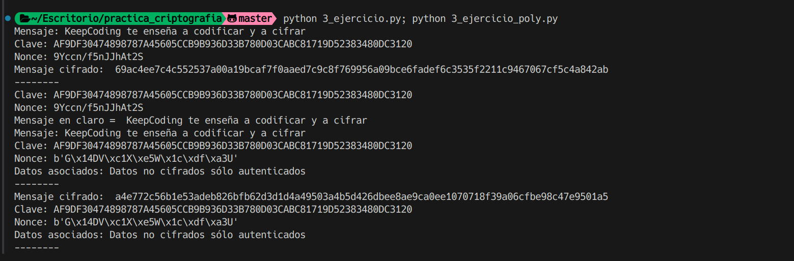

# Ejercicio 3

Se nos pide cifrar un mensaje en ChaCha20
Despues se nos pide aumentar la seguridad del cifrado autenticando el mensaje con Poly1305, esto nos permitira detectar si el mensaje ha sido modificado.

Después de cifrar el mensaje, se nos pide mejorar la seguridad del cifrado autenticando el mensaje con Poly1305, esto nos permitirá detectar si el mensaje ha sido modificado.

## Datos

```bash
Mensaje: KeepCoding te enseña a codificar y a cifrar

Clave: AF9DF30474898787A45605CCB9B936D33B780D03CABC81719D52383480DC3120

Nonce: 9Yccn/f5nJJhAt2S
```

## Procedimiento

En python, deberemos asegurarnos de tener los datos necesarios, el mensaje, clave y nonce, convertimos a bytes el mensaje y la clave, y ciframos el mensaje con la clave y el nonce.

Para autenticar el mensaje, deberemos usar Poly1305, deberemos generar un Nonce de 12 bytes, unos datos adicionales que servirán para autenticar el mensaje, y la clave, con estos datos, generamos un tag que servirá para autenticar el mensaje.

