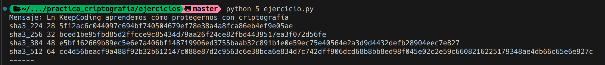
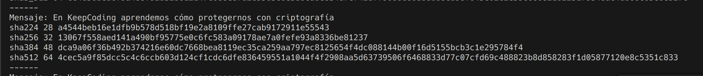
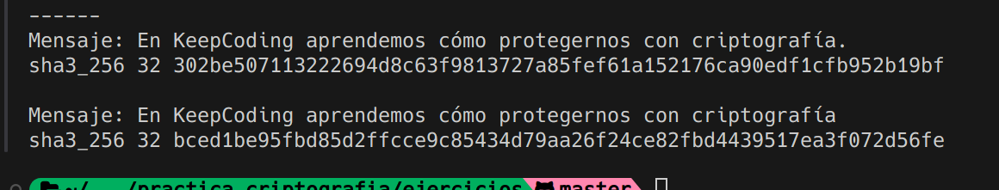

## Ejercicio 5

Se nos da un mensaje y su salida en keccak SHA3 y SHA2 y se nos pide identificar el tipo de SHA que se utilizó. 
Tambien se nos pide convertir a SHA3 Keccak de 256 bits y analizar un mensaje con un cambio menor en el string.

### Datos

```bash
Mensaje_original: En KeepCoding aprendemos cómo protegernos con criptografía

SHA3: bced1be95fbd85d2ffcce9c85434d79aa26f24ce82fbd4439517ea3f072d56fe

SHA2: 4cec5a9f85dcc5c4c6ccb603d124cf1cdc6dfe836459551a1044f4f29
08aa5d63739506f6468833d77c07cfd69c488823b8d858283f1d05877120e8c
5351c833

Mensaje_diferente: En KeepCoding aprendemos cómo protegernos con criptografía.
```

### Procedimiento


Podemos saber el tipo de SHA3 por el largo del hash, en este caso, el hash tiene 32 bytes, por lo que se utilizó SHA3-256.

Podemos comprobarlo con la salida al convertir el mensaje:

```bash
SHA3 del ejercicio: 
bced1be95fbd85d2ffcce9c85434d79aa26f24ce82fbd4439517ea3f072d56fe
```



Si utilizamos SHA2:

```bash
SHA2 del ejercicio: 
4cec5a9f85dcc5c4c6ccb603d124cf1cdc6dfe836459551a1044f4f2908aa5d
63739506f6468833d77c07cfd69c488823b8d858283f1d05877120e8c5351c833
```



Podemos ver que el algoritmo utilizado fue sha512.

Si convertimos el mensaje dado y comparamos con el anterior:



Podemos ver que el hash cambia completamente, por lo que los hashes son lo suficientemente distintos con un cambio menor.