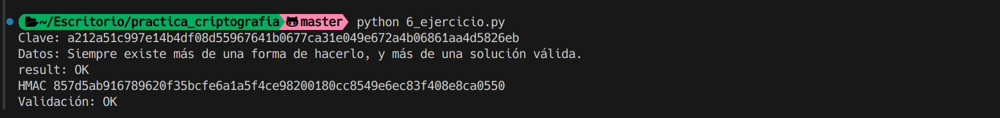

## Ejercio 6

Se nos pide calcular la HMAC del mensaje "Siempre existe más de una forma de hacerlo, y más de una solución válida" usando la clave almacenada en el keystore.

## Datos

Mensaje: Siempre existe más de una forma de hacerlo, y más de una solución válida

Clave: A212A51C997E14B4DF08D55967641B0677CA31E049E672A4B06861AA4D5826EB

## Procedimiento

Extaemos la clave del keystore

Utilizamos la función para crear el HMAC y obtenemos y validamos el resultado:

