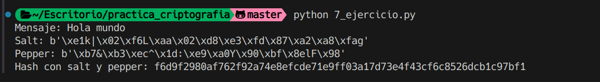

# Ejercicio 7

Se nos hacen las siguientes preguntas:

- ¿Por qué SHA-1 no es seguro?
- ¿Cómo fortalecer SHA-256 y mejorar su seguridad?

## Procedimiento

SHA-1 es vulnerable a colisiones entre hashes, con diferentes mensajes se puede generar el mismo hash, esto puede ser un problema para la integridad de los datos.

En cuanto a SHA-256, es un algoritmo más seguro que SHA-1, pero se puede mejorar su seguridad añadiendo un salt a los datos antes de cifrarlos, esto hará más difícil la generación de colisiones entre hashes.

Adicionalmente, podemos añadir un pepper a los datos antes de cifrarlos, esto añadirá una capa de seguridad adicional a los datos cifrados.

