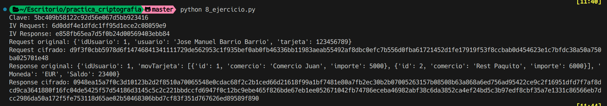

# Ejercicio 8

Se nos muestra una API REST que recibe datos sensibles, como tarjetas de crédito, nombres, ids, etc.

Se nos pide buscar información sobre qué algoritmo usar para cifrar estos datos, asegurando la integridad y confidencialidad de los mismos.

Se asume que el sistema no usa TLS (https) para cifrar los datos.

## Procedimiento

Podemos usar o AES/GCM o Chacha20-poly1305 para el cifrado, los dos aseguran integridad y confidencialidad.

Si buscamos rapidez, podemos elegir Chacha20-poly1305, que es más rápido que AES/GCM.

