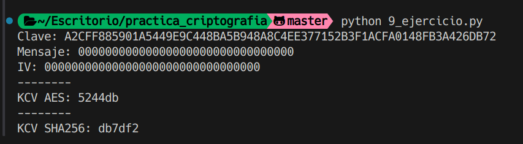

# Ejercicio 9

## Enunciado

Se nos pide calcular el KCV de una clave AES, necesitaremos el KCV(SHA-256) y el KCV(AES).

KCV(SHA-256) => primeros 3 bytes de SHA-256 de la clave

KCV(AES) => primeros 3 bytes de AES de la clave o toda??

## Datos

Clave AES: A2CFF885901A5449E9C448BA5B948A8C4EE377152B3F1ACFA0148FB3A426DB72

mensaje: 00000000000000000000000000000000

iv: 00000000000000000000000000000000

## Procedimiento

Para obtener el KCV de la clave AES ciframos el mensaje (en este caso 16 bytes de 0) con la clave AES y el IV proporcionados. Luego obtenemos los primeros 3 bytes de la salida y los convertimos a hexadecimal.

Para obtener el KCV de la clave SHA-256, simplemente obtenemos los primeros 3 bytes de la salida de la función hash SHA-256 de la clave y los convertimos a hexadecimal.

